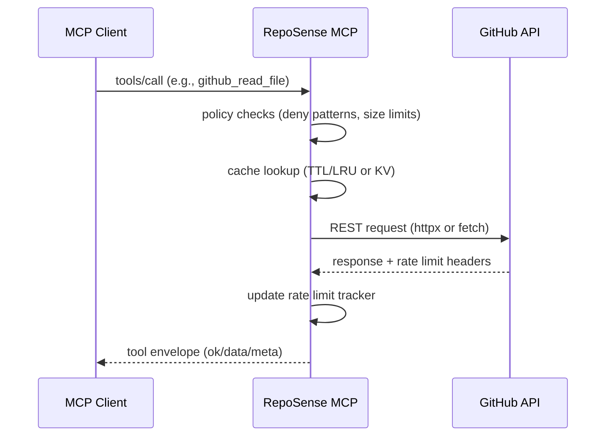

# Architecture

RepoSense MCP has two runtime implementations that expose a shared tool contract:

- **Python server**: FastAPI + FastMCP (HTTP MCP endpoint mounted under `/mcp`)
- **Worker**: Cloudflare Worker + OAuth Authorization Server + KV + Durable Object

---

## High-level flow

---

## Python server runtime

- HTTP server: FastAPI
- MCP transport: FastMCP HTTP app mounted at `/mcp`
- GitHub client: `httpx.AsyncClient` with connection pooling
- Cache: in-memory TTL + LRU (`TTLCache`)
- Rate limit tracking: parse `X-RateLimit-*` headers into a shared tracker
- Logging: structlog JSON logs + request id propagation

**Auth model (Python):**
- Optional `REPOSENSE_API_KEY` check for `/mcp/*` (Bearer)
- GitHub access uses a local token store file (example committed; real file ignored)

---

## Worker runtime

- HTTP server: Cloudflare Worker `fetch()`
- MCP endpoint: `POST /mcp`
- OAuth authorization server endpoints:
  - `/.well-known/oauth-authorization-server`
  - `/authorize`, `/token`, `/revoke`
- Storage:
  - KV for OAuth codes/tokens and tool cache
  - Durable Object (SQLite) for per-token RPM rate limiting

**Auth model (Worker):**
- `/mcp` requires `Authorization: Bearer <access_token>`
- Access tokens are issued by the Worker OAuth flow and stored in KV
- `/authorize` is intended to be protected by **Cloudflare Access** (JWT verified against Access JWKS)

---

## Caching strategy

### Python
- Branch refs (mutable) default to short TTL (`cache_branch_ttl_seconds`)
- SHA refs (immutable) can be cached longer
- Cache is process-local; scaling horizontally requires external cache

### Worker
- KV cache uses hashed keys per tool call signature
- TTL buckets per tool type (tree/file/search/rate limit)
- KV is eventually consistent (cache clear is best-effort across PoPs)

---

## Rate limiting

### GitHub API rate limits
- Both runtimes track GitHub rate limit info and can expose a `github_rate_limit_status` tool.

### Worker RPM cap (your own limiter)
- Durable Object `RateLimiterDO` enforces per-token requests per minute.
- This protects your Worker and your GitHub quota from abuse.
